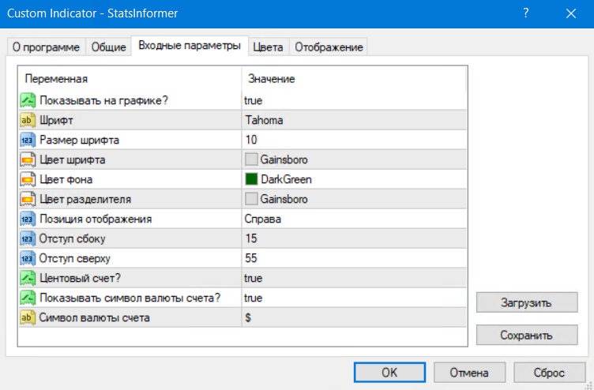
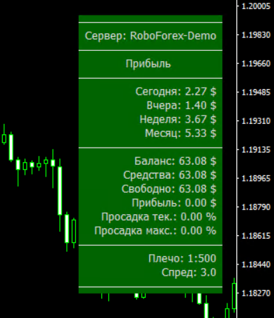

# Forex Stats Informer indicator for MT4
Indicator for MetaTrader4 (MT4) which shows trading statistics.

## Installation
- Copy [StatsInformer.mq4](StatsInformer.mq4) file to `<METATRADER_DATA_DIR>\MQL4\Indicators` folder.
- Update list of indicators on Navigator panel.
- Drag `StatsInformer` indicator on a graph.

## Configuration
Available settings of indicator:

## Usage
Check statistics at side view:

## History
This indicator is based on [stat informer2.mq4](releases/1.0/stat&#32;informer2.mq4) initially developed by NeO since 2012.
I've just refactored it for my needs, added new features, etc.

Here was the original view:

## Contribution
Feel free to create issue or pull request if any ideas.
